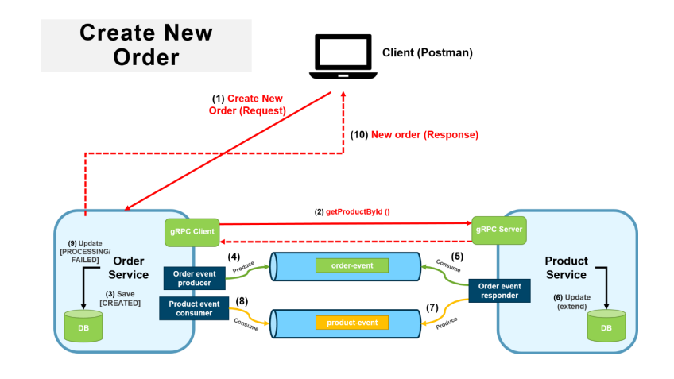
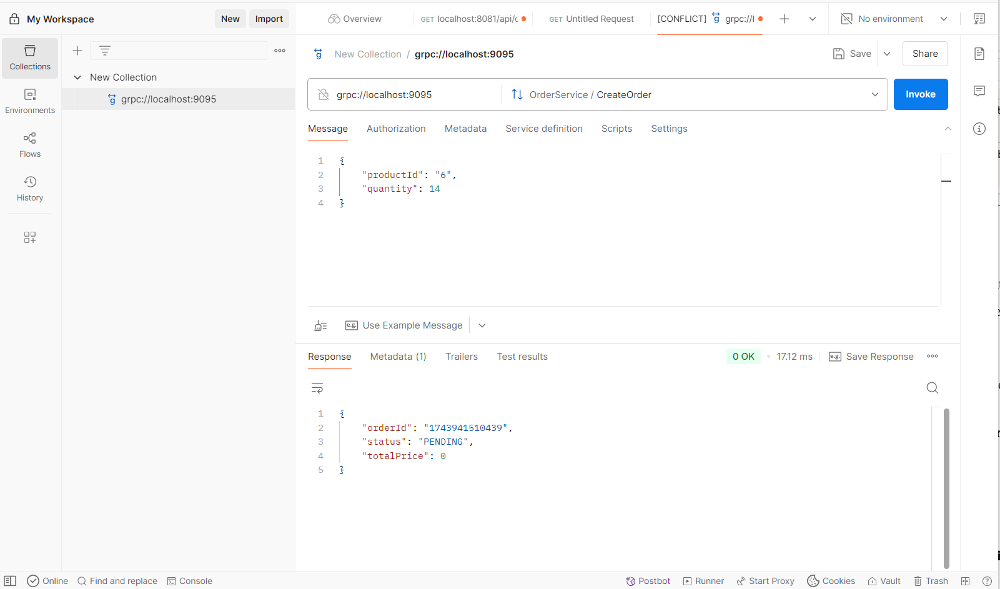
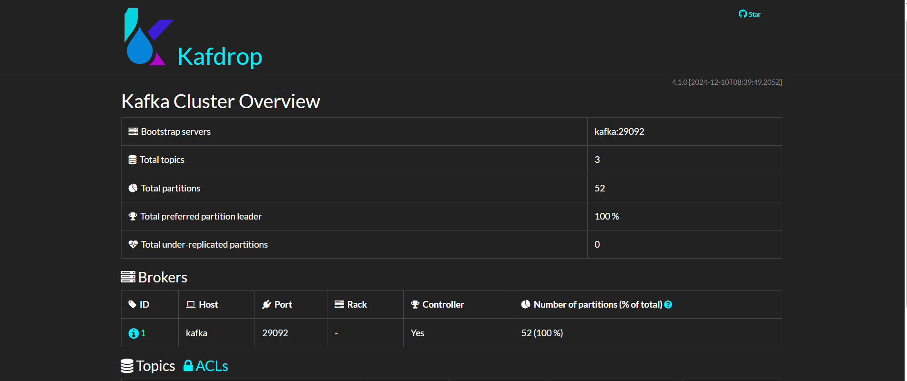

# gRPC-Order-Payment-Microservices
# 🛒 Product Order System - Distributed Transaction (Microservices)

This system implements the **Create Order** distributed transaction, using **Spring Boot**, **gRPC**, and a combination of **MongoDB** and **PostgreSQL** databases. The system handles order creation, product availability checks, and order status updates based on the product's availability. It ensures the integrity of the transaction across multiple microservices, following the **Saga Pattern** for managing distributed transactions.

---

## 📦 Tech Stack

| Layer              | Technology Used            |
|--------------------|----------------------------|
| Backend Services   | Spring Boot (REST APIs, gRPC) |
| Messaging          | Apache Kafka               |
| Databases          | MongoDB (Order Service), PostgreSQL (Product Service) |
| Containerization   | Docker & Docker Compose    |
| Build Tool         | Gradle                     |
| gRPC Communication | Protocol Buffers (protobuf)|
| Java Version       | Java 17+                   |
| Monitoring         | Kafdrop                    |

---

## 🧩 Project Structure

```
ProductOrder/
├── .gradle/
├── .idea/
├── assets/
│   └── architecture.png
├── build/
├── gradle/
├── microservices/
│   ├── build/
│   ├── orderService/
│   ├── ProductService/
│   ├── src/
│   └── build.gradle
├── proto-api/
│   └── Proto files for gRPC definitions
├── src/
├── Utils/
│   ├── Custom exceptions
│   ├── Models and DTOs
│   ├── Events
│   └── Global error handling
├── create-projects.bash
├── build.gradle
├── settings.gradle
├── gradlew
├── .gitignore
├── gradlew
└── docker-compose.yml
```

## 🧱 Microservices

| Service Name       | Description                                                             | Database      |
|--------------------|-------------------------------------------------------------------------|---------------|
| **Order Service**  | Manages orders, creates new orders, and updates order status based on product availability. | MongoDB |
| **Product Service**| Handles product details, availability checks, and updates the product's stock. | PostgreSQL |

### 🔄 gRPC Communication

| gRPC Method         | Description                                                            |
|---------------------|------------------------------------------------------------------------|
| `getProductById()`  | Called by the Order Service to retrieve product details (including price) from the Product Service. |
| `checkProductAvailability()` | Used by the Order Service to check product availability in the Product Service. |

---

## 🧠 How It Works

1. **Order Request**:
    - A new order request comes to **Order Service** with product ID and quantity.
    - The **Order Service** calls `getProductById()` in the **Product Service** to fetch the product details.

2. **Check Product Availability**:
    - Once the **Order Service** has the product data (including price), it proceeds to check the product's availability.
    - The **Order Service** sends a `checkProductAvailability()` event to the **Product Service**.

3. **Product Availability**:
    - If the product is available:
        - **Product Service** updates the product stock.
        - Sends a **product event** with the `AVAILABLE` state to the **Order Service**.
        - **Order Service** updates the order status to `PROCESSING`.
    - If the product is out of stock:
        - **Product Service** sends a **product event** with the `OUT_OF_STOCK` state to the **Order Service**.
        - **Order Service** updates the order status to `FAILED`.

4. **Transaction Status**:
    - **Order Service** updates the database with the final state of the order: either `PROCESSING` or `FAILED`.

---

## 🏗️ Architecture Diagram



> The architecture diagram illustrates:
> - **Order Service** calling **Product Service** via **gRPC**
> - **gRPC Methods** (`getProductById()`, `checkProductAvailability()`)
> - The flow of events (order creation, product availability check, and status update)
> - **MongoDB** for storing order data and **PostgreSQL** for product data
> - **Kafka** for event messaging between services

---

## 🚀 Getting Started

### ✅ Prerequisites

- Docker & Docker Compose
- Java 17+
- Gradle

### 🐳 Running the System

1. Clone the repository:
```bash
git clone https://github.com/your-username/product-order-system.git
cd ProductOrder
```

2. Start the services  along with the infrastructure (MongoDB, PostgreSQL, Kafka, Zookeeper, and Kafdrop) using Docker Compose:
```bash
docker-compose up -d
```


### 🔍 Verifying the Setup

1. Check if services are running:
```bash
# Check Docker containers status
docker-compose ps

# Check MongoDB status
docker exec -it mongodb mongosh -u root -p password

# Check PostgreSQL status
docker exec -it postgres psql -U postgres -d productorder
```

2. Access Kafdrop for Kafka monitoring:
    - Open your browser and navigate to: `http://localhost:9000`


---

## 📝 API Documentation
Example of API testing with Postman



## 📦 Docker Compose Services

The `docker-compose.yml` file sets up the following services:

| Service Name | Description                                     | Ports         |
|--------------|-------------------------------------------------|---------------|
| Zookeeper    | Coordination service for Kafka                  | 2181          |
| Kafka        | Message broker for event-driven communication   | 9092          |
| MongoDB      | NoSQL database for Order Service                | 27017         |
| PostgreSQL   | Relational database for Product Service         | 5432          |
| Kafdrop      | UI for monitoring Kafka topics and messages     | 9000          |

### Network and Volumes

- **Network**: `product-order-network` (bridge network for service communication)
- **Volumes**:
    - `mongodb_data`: Persistent storage for MongoDB
    - `postgres_data`: Persistent storage for PostgreSQL

---


---

## 📊 Monitoring and Logging

- Service logs are available in the console output of each service
- Infrastructure container logs can be viewed with `docker-compose logs [service-name]`
- Kafka topics and messages can be monitored via Kafdrop UI at `http://localhost:9000`
  

---

## 📄 Key Components

### Proto API
The `proto-api` directory contains Protocol Buffer definitions for gRPC communication between services.

### Utils
The `Utils` directory contains:
- Custom exception classes
- Data Transfer Objects (DTOs) and Models
- Event classes for Kafka messaging
- Global error handling components

---

## 🧪 Testing

Run tests with Gradle:
```bash
# Test all services
./gradlew test

# Test specific service
./gradlew :microservices:orderService:test
./gradlew :microservices:ProductService:test
```

---

## 🔄 Roadmap & Future Enhancements

This project is actively evolving. In the pipeline is the development of additional microservices including a dedicated Notification Service for order updates and an Infrastructure layer incorporating API Gateway, Circuit Breaker patterns. Kubernetes deployment configurations are also under development to enable container orchestration, autoscaling, and improved resilience for production environments.

---

